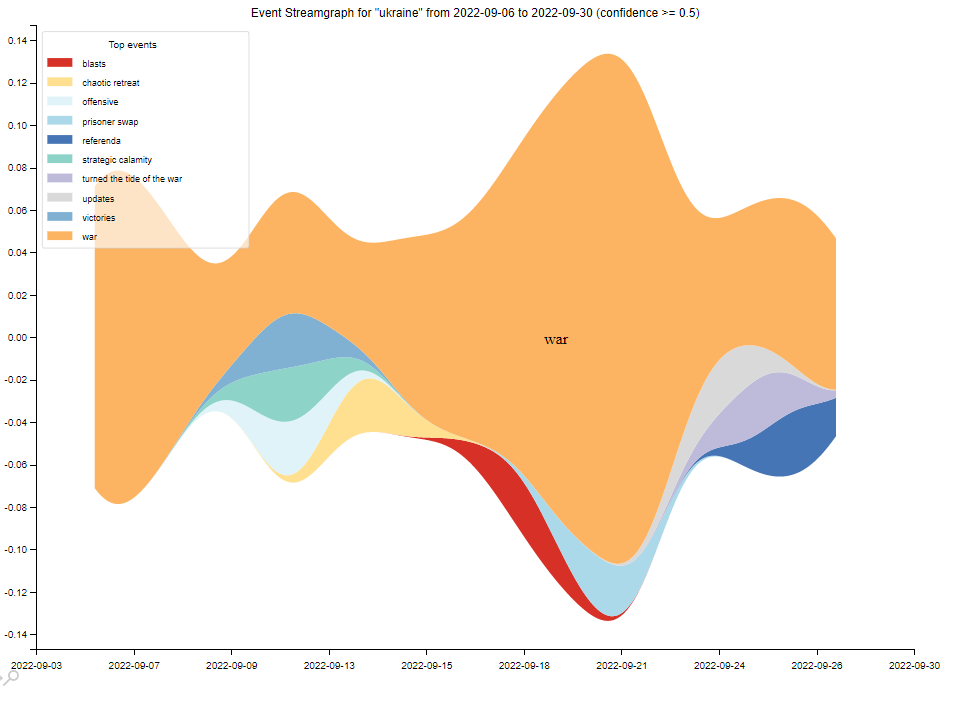

# Event Extraction & Detection
Repository for QA-based event detection and extraction from text (news and social media).



## Installing dependencies

1. Clone this repository: 
```
https://github.com/sodalabsio/event-detection-extraction.git
```
2. Create a virtual environment (optional but recommended) and activate it:
```
virtualenv -p python3 venv
source venv/bin/activate
```

3. Install the dependencies:
```
pip install -r requirements.txt
```

NB: Tested on `Python 3.8`.

## Running the code

Here's the usage in detail (also accessible through `python run.py -h`):
```
usage: run.py [-h] --query QUERY --start-date START_DATE --end-date END_DATE --source {news,twitter} --output-path OUTPUT_PATH [--news-outlets NEWS_OUTLETS] [--event-confidence EVENT_CONFIDENCE] [--top-k TOP_K]

optional arguments:
  -h, --help            show this help message and exit
  --query QUERY         Query to search for (country or place full name, for example)
  --start-date START_DATE
                        Start date of the event in YYYY-MM-DD format
  --end-date END_DATE   End date of the event in YYYY-MM-DD format
  --source {news,twitter}
                        Source of events to pull from such as news or twitter
  --output-path OUTPUT_PATH
                        Output directory to write the results
  --news-outlets NEWS_OUTLETS
                        A list of trusted news sources to filter by (optional)
  --event-confidence EVENT_CONFIDENCE
                        A minimum confidence threshold for events
  --top-k TOP_K
```

For example:
```
    python3 -m run  \
    --query=Iran  \
    --start-date=2022-09-06  \
    --end-date=2022-09-30  \
    --source=news  \
    --output-path=./output  \
    --event-confidence=0.5  \
    --top-k=10
```

## Note
- The query string is case-insensitive i.e. `Ukraine` and `ukraine` are equivalent.
- The news and event detection parts of the pipeline are cached once run (for a given `--query`, `--start-date` and `--end-date`) to avoid re-running them. To re-run the pipeline, delete the cache files in the `output` directory.
- The pipeline can be subsequently run with different values for `--event-confidence` and `--top-k`.
- All data and graphs are exported under the `output` directory. The directory is automatically created during execution.

## References
- Lyu, Q., Zhang, H., Sulem, E., & Roth, D. (2021, August). [Zero-shot event extraction via transfer learning: Challenges and insights](https://aclanthology.org/2021.acl-short.42.pdf). In Proceedings of the 59th Annual Meeting of the Association for Computational Linguistics and the 11th International Joint Conference on Natural Language Processing (Volume 2: Short Papers) (pp. 322-332).
- Hamborg, F., Breitinger, C., & Gipp, B. (2019). [Giveme5w1h: A universal system for extracting main events from news articles](https://arxiv.org/abs/1909.02766). arXiv preprint arXiv:1909.02766.
